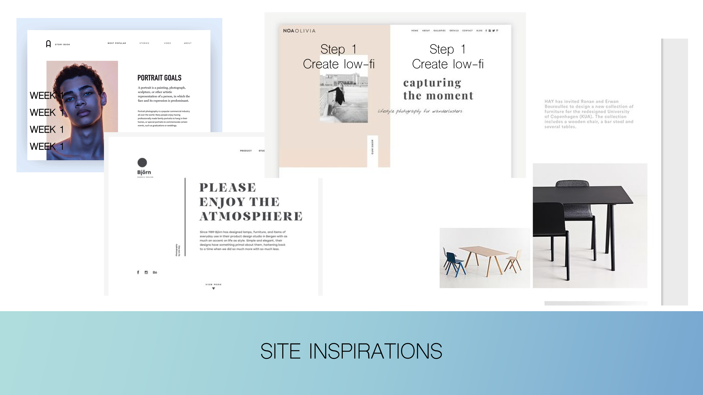

# Project 1: Responsive Website
Student: u3228460 

Front-end Web Design (11056), Semester 1 2022

GitHub link: https://github.com/bianca-schulze/u3228460_website

## Reflection 

>“Learning HTML and CSS is a lot more challenging than it used to be. Responsive web design adds more layers of complexity to design and develop websites.” (Lett, 2018)
>– Jacob Lett 

As I progressed through this assignment, Jacob Lett’s quote regarding responsive design became more and more apparent. What started as a simple idea, turned out to be a lot more difficult to achieve than I thought, mostly due to the responsiveness of the site. However, I am happy with what I have been able to achieve. I have developed a number of new skills and gained confidence in HTML and CSS that will certainly contribute to my future career. 

### Challenges

* Margins and wrappers
* Responsiveness
* JavaScript 

#### Margins and wrappers 

Whilst building the index page during the first few weeks of this assignment, I was faced with a number of issues that were the result of an incorrectly placed wrapper around the **body** element. I had accidentally placed the closing **div** element in between the closing **footer** and **body** tags rather than after the closing **main** tag. This created some harsh margins that restricted the content of my site in different ways. To resolve this issue, I needed a fresh set of eyes to point out the mistake. Human error is always something I need to take into consideration when developing sites, however hopefully this will reduce as I progress throughout my career.

#### Responsiveness 

This was my first website that was required to be responsive. I found media queries relatively easy to learn, however the issue I faced was that I needed to create multiple media queries for my main navigation. This was both time consuming, and ineffective. Secondly, since I identified the target audience would be slightly older, I designed the website to fit larger screens, and applied media queries to fit smaller screens. I found that due to a lack of planning for mobile sized screens, I was not entirely happy with the result. I would have preferred my main navigation to shrink into a menu, as it currently takes up over a third of a mobile’s screen. Given that the majority of web traffic is through smartphones (Statista, 2021), I understand the importance of responsive web design. In future, I would like to learn more about viewport widths, responsive sizing and menu elements so that users can access the site on any device. 

#### JavaScript 

Prior to this assignment I had not had the opportunity to experiment with JavaScript. I found it quite challenging. There were two elements of my assignment that I attempted to animate; the *Artist Gallery* (lines 89 - 153 on festivals-2020.html) and the *Meet the Team* grid (lines 54 - 89 on about.html). For the Artist Gallery, I researched different slideshow displays and I was inspired by the code from [W3Schools](https://www.genome.gov/). An error displayed when I implemented the code into my JavaScript file. Unfortunately I was unable to troubleshoot the error and removing it would have broken the code. The second JavaScript element I attempted to add was the *Meet the Team* grid. The code would have allowed users to click on the person and a description of their role would have appeared below. I was able to achieve this, however if the user selected all three people, all three paragraphs would display. As JavaScript was not a requirement of this assignment, I ultimately decided to remove this element as it was taking up too much of my time trying to resolve. Moving forward, I would like to learn more of the basic fundamentals of JavaScript so that I can understand what is being applied, how to change it and how to fix any errors. 

Overall minor challenges I faced, like using an incorrect element, will hopefully become less likely to occur the more familiar I become with code. However, some of the major challenges I faced in relation to responsiveness and JavaScript were due to a lack of understanding, and will require a development in this skill set to improve. 

### Successes  

* Understanding HTML and CSS
* Utilising prototyping applications 
* Time management 

#### Understanding HTML and CSS

Going into this assignment I had a basic understanding of HTML semantics and CSS syntax rules. This meant that I was able to dive in, define the structure and stylise the code with different properties I already knew. Another benefit of having coded a website previously, was that I knew I needed to spend 90% of my time coding the index page, prior to developing the code for the secondary pages. This meant that I did not spend too much time changing my header and footer elements when making updates. I also felt a lot more confident using the ‘inspect’ tool in Google Chrome, which allowed me to swiftly make changes to sections of the style sheet. 

#### Utilising prototyping applications 

Knowing that I am a visual person, I decided to create a high-fidelity prototype in Adobe XD prior to coding the website. This allowed me to visualise the site, plan elements of the page and provide scope for what I wanted to achieve. Reflecting back on the challenges I faced in relation to responsiveness, I wish that I had spent time prototyping a mobile sized version of the website, so that I had more direction here. Originally I had planned to have a very minimalistic aesthetic, however after asking a few people for their opinions, it was suggested that the site was quite plain. With this feedback, I added a gradient banner across the top and bottom to give the website some differentiating features. 

#### Time management  

Given the weight of this assignment I decided to plan as soon as possible. I knew there were going to be elements that I would struggle with, like JavaScript. For this reason, I created a project plan for the assignment to help manage my time. By following this plan I was able to track my progress and meet the deadline for submission.

### Future aspirations  

Going into this assignment, I had a basic understanding of HTML and CSS, so I designed the site with these limitations in mind. If I had more experience, or could have hired a professional developer, I would have included the following:

* Main navigation with a hover drop down that included a list of the festivals. 
* An animated hero banner that showcases the artwork that have been displayed over the years, like [this website.](https://solace-store.com/)
* Coloured background blocks throughout the website, like [this website.](https://www.octaevo.com/)
* Images that fade-in on scroll, like [this website.](https://misuko.be/)

## Conclusion

It is rewarding to see what was once an idea, become a sketch on a piece of paper, become a working prototype to then become a fully functional website. The iterative design process is both challenging, in a sense that you have to be adaptive and innovative, yet rewarding to look back at the work that has been accomplished. 

## References

### Site inspirations

#### Links

* Minimal, black and white colour scheme [inspired by this website.](https://nl.pinterest.com/pin/335940453445281077/)
* Home page grid layout [inspired by this website.](https://nl.pinterest.com/pin/335940453435812873/)
* Main navigation [inspired by this website.](https://nl.pinterest.com/pin/67835538128438844/)
* Meet the team grid [inspired by this website.](https://thecorrespondent.com/correspondents)

All fonts were sourced from [Google Fonts.](https://fonts.google.com/)

Social media icons were sourced [here.](https://thehungryjpeg.com/product/109876-sketch-social-media-icons)

### HTML and CSS code

* Main navigation gradient generator found [here.](https://cssgradient.io/)
* PX to EM converter found [here.](https://www.w3schools.com/tags/ref_pxtoemconversion.asp)
* JavaScript validator found [here.](https://codebeautify.org/jsvalidate)
* HTML validator found [here.](https://validator.w3.org/)
* CSS validator found [here.](https://jigsaw.w3.org/css-validator/)
* News card deck (featured on index.html lines 65-98, stylesheet lines 187-224) found [here.](https://www.w3schools.com/howto/howto_css_cards.asp)
* Artists gallery (featured on about.html lines 89-151, stylesheet lines 341-430, JavaScript lines 1-35) found [here.](https://www.w3schools.com/howto/howto_js_slideshow_gallery.asp)
* Contact form (featured on contact.html lines 46-59 and donate.html lines 52-103, stylesheet lines 433-497) found [here.](https://www.w3schools.com/howto/howto_css_register_form.asp)
* Newsletter subscription (featured on about.html, festivals-2022.html, festivals-2020.html, festivals-2018.html and festivals-2016.html) found [here.](https://www.w3schools.com/howto/howto_css_newsletter.asp)
* Back to top (featured in footer) found [here.](https://www.w3schools.com/howto/howto_js_scroll_to_top.asp)
* Donate button (featured in main navigation, stylesheet 124-145) found [here.](https://www.w3schools.com/tags/tag_button.asp)

### Appendices

1) A low-fidelity prototype of the curation process of the main navigation.

2) Low-fidelity prototypes of the secondary pages.

3) Developing the Contact Form. 

### Reflection references

* Duò, M. (2022). 76 Proven Tactics to Drive Traffic to Your Website. Retrieved 15 April 2022, from https://kinsta.com/blog/how-to-drive-traffic-to-your-website/

* Lett, J. (2018). Bootstrap 4 Quick Start: Responsive Web Design and Development Basics for Beginners (1st ed.). Bootstrap Creative.

* Statista. (2021). Mobile percentage of website traffic 2021 | Statista. Retrieved 14 April 2022, from https://www.statista.com/statistics/277125/share-of-website-traffic-coming-from-mobile-devices/
